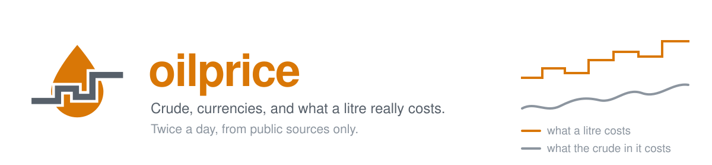
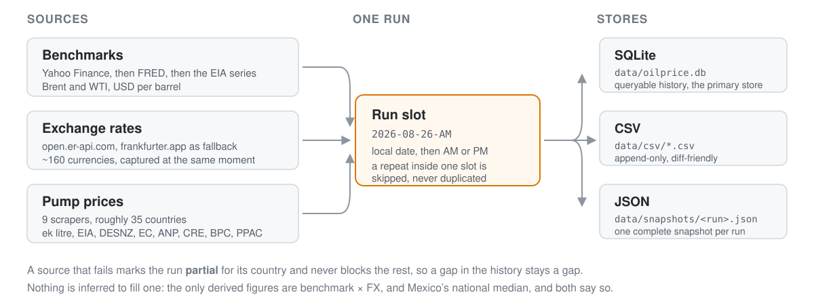

<p align="center">
  
</p>

<p align="center">
  <a href="https://ursacode.github.io/oilprice/"><b>See the data &rarr;</b></a> &nbsp;·&nbsp;
  <a href="https://github.com/UrsaCode/oilprice/actions/workflows/tests.yml"></a>
  <a href="https://github.com/UrsaCode/oilprice/actions/workflows/collect.yml"></a>
  
  <a href="LICENSE"></a>
</p>

---

**Crude benchmarks, exchange rates and real pump prices — collected twice a
day and stored, from public sources only.**

No API keys, no paid feeds, no account. Point it at a machine or let GitHub
Actions run it, and it accumulates a history you can query in SQL. Every
figure carries the source it came from, so anything stored here can be
traced back to whoever published it.

The collected data is charted at **[ursacode.github.io/oilprice](https://ursacode.github.io/oilprice/)** —
what a litre costs in every country reached, against what the crude in it
costs, which is one figure for the whole world. The page is rebuilt after
every collection.

What it collects:

1. **International benchmarks** — Brent and WTI crude in USD per barrel.
   Sources tried in order, no API keys needed: Yahoo Finance, then FRED
   (official St. Louis Fed spot series — reliable from datacenter/CI IPs
   where Yahoo often blocks, lags a day or two), then the EIA spot series
   republished on GitHub.
2. **Worldwide local-currency view** — the international benchmark expressed
   in **every country's currency** (~190 countries), per barrel and per
   litre, using free USD exchange rates captured at the same moment
   (open.er-api.com, frankfurter.app fallback).
3. **Local pump prices** — actual market prices per litre. Built-in
   scrapers cover roughly 35 countries:

   | Source | Countries | Products | Currency |
   |---|---|---|---|
   | [ek litre](https://eklitre.pk) | Pakistan | petrol, diesel, kerosene, light diesel | PKR |
   | EIA | United States | petrol, diesel | USD |
   | gov.uk (DESNZ) | United Kingdom | petrol, diesel | GBP |
   | EC Weekly Oil Bulletin | 27 EU member states | petrol, diesel, heating oil, LPG | EUR |
   | ANP | Brazil | petrol, premium, diesel, diesel S10, ethanol | BRL |
   | Ministry of Petroleum | Egypt | petrol 80/92/95, diesel, kerosene | EGP |
   | CRE open data | Mexico | petrol, premium, diesel | MXN |
   | BPC | Bangladesh | petrol, octane, diesel, light diesel, kerosene, furnace oil | BDT |
   | PPAC | India | petrol, diesel (Delhi reference) | INR |

   Pakistan is read from [ek litre](https://eklitre.pk), a public record of
   Pakistani fuel prices that keeps every OGRA notification since 2006
   beside the archived page each figure was read from. Its `/v1/prices`
   endpoint is the only Pakistani source here that states an **effective
   date** alongside the price, so a run knows whether it is storing today's
   notification or a fortnight-old one still in force; that date travels
   into the `source` column. PSO's own fuel-price page and hamariweb remain
   as fallbacks if the record cannot be reached.

   The Commission publishes the bulletin in euro for *every* member state,
   including those outside the eurozone, so those rows are stored as EUR
   rather than the national currency. US prices are published per gallon
   and converted to litres on the way in. Mexico is the one derived figure:
   the regulator publishes only per-station prices, so the stored national
   price is the median across reporting stations and its `source` says so.
   Bangladesh needs one extra step: BPC serves an incomplete certificate
   chain, so the missing (long-lived) intermediate ships in
   `oilprice/data` and is added to the trusted roots for that request
   rather than turning verification off.

   India publishes daily prices only as a PDF, and only for the four
   metro cities; Delhi is stored as the conventional reference and the
   `source` records it. Note `ppac.gov.in` refuses connections from some
   networks, in which case that run is marked partial for India alone.

   Countries without a scraper can be entered manually.

Everything is *stored only* — no analysis, no forecasting, no blending of two
publishers into one averaged figure. Three formats are written on every run so
the data is easy to consume later:

| Store | Path | Purpose |
|---|---|---|
| SQLite | `data/oilprice.db` | queryable history, primary store |
| CSV | `data/csv/*.csv` | append-only, diff-friendly history |
| JSON | `data/snapshots/<run>.json` | complete snapshot of each run |

<p align="center">
  
</p>

## How "twice daily" works

Each collection belongs to a **run slot**: local date + `AM`/`PM`
(timezone defaults to `Asia/Karachi`). Re-running inside the same slot is
skipped (or overwrites with `--force`) — never duplicated. So any of the
schedulers below can fire as often as you like; you still get exactly two
clean data points per day.

## Quick start

```bash
pip install -r requirements.txt

python -m oilprice run              # collect + store once, right now
python -m oilprice show             # latest stored prices
python -m oilprice show --country PK  # + benchmark in PKR
```

## Scheduling options (pick one)

**A. GitHub Actions (recommended, no server needed).**
Configured in `.github/workflows/collect.yml`: runs at 09:00 and 21:00 PKT,
collects, and commits the new data back to the repository. Fork this repo
and the workflow starts on its own schedule; it needs no secrets.

**B. Built-in scheduler** (keeps a process running):

```bash
python -m oilprice schedule --immediately
```

Runs at 09:00 and 21:00 local time by default.

**C. cron** on any Linux box:

```cron
0 9,21 * * * cd /path/to/oilprice && /usr/bin/python3 -m oilprice run >> data/cron.log 2>&1
```

## Manual entry for any country

Free, reliable pump-price APIs covering *all* countries don't exist
(commercial ones like GlobalPetrolPrices are paid). Until a scraper exists
for a country, record prices manually — they go into the same store:

```bash
python -m oilprice add-local --country AE --product petrol --price 3.02
# currency is inferred from the country (AED); override with --currency
```

## Adding a scraper for another country

1. Create `oilprice/fetchers/<country>.py` with a `fetch()` returning a
   list of `models.LocalPrice`.
2. Register it in `oilprice/fetchers/__init__.py` → `LOCAL_SCRAPERS`.

The pipeline runs every registered scraper each cycle; one country failing
only marks the run `partial`, it never blocks the rest.

A scraper may cover several countries at once — the registry key is used
only for logging, while each `LocalPrice` carries its own `country_code`.
The EU bulletin fetcher uses this to return every member state from one
file.

## Configuration (environment variables)

| Variable | Default | Meaning |
|---|---|---|
| `OILPRICE_TZ` | `Asia/Karachi` | timezone for slots & scheduler |
| `OILPRICE_SCHEDULE_HOURS` | `9,21` | built-in scheduler hours |
| `OILPRICE_DATA_DIR` | `./data` | where all data is written |
| `OILPRICE_HTTP_TIMEOUT` / `OILPRICE_HTTP_RETRIES` | `30` / `3` | HTTP behaviour |

## Database schema

- `runs` — one row per slot: `run_id` (`2026-08-13-AM`), status
  (`ok` / `partial` / `failed`).
- `international_prices` — Brent/WTI in USD per barrel, per run.
- `fx_rates` — 1 USD → currency rate for ~160 currencies, per run.
- `benchmark_local` — **derived**: benchmark × FX per country, per barrel
  and per litre. This is the "oil price in local currency" for every
  country; it is *not* the pump price.
- `local_prices` — actual pump prices (scraped or manual), local currency.

Example queries:

```sql
-- Petrol price history in Pakistan
SELECT run_id, price FROM local_prices
WHERE country_code='PK' AND product='petrol' ORDER BY run_id;

-- Brent in PKR per litre over time
SELECT run_id, price_per_litre FROM benchmark_local
WHERE country_code='PK' AND benchmark='BRENT' ORDER BY run_id;
```

## The published page

`docs/` holds a static page charting whatever the database contains. It has no
build step, no framework and no third-party script — it reads one generated
file and draws the rest itself.

```bash
python tools/build_site.py            # writes docs/summary.json from the database
python -m http.server -d docs 4173    # then open http://127.0.0.1:4173
```

`summary.json` is a projection and is never a source, so it is not committed:
the Pages workflow builds it from `data/oilprice.db` at deploy time and the
page therefore cannot show a figure the repository does not carry.

## Tests

```bash
pip install pytest
python -m pytest tests/ -v
```

Tests run fully offline (network fetchers are mocked), so a parser can be
proved against captured markup without touching any source site.

## Scope, and what this is not

It stores. It does not interpret. There is no forecasting, no "fair price"
calculation, no blending of two publishers into one averaged figure — where
two sources disagree, whichever one was read is named in `source` and the
other is not silently mixed in. Derived numbers exist in exactly two
places and both say so: `benchmark_local` (benchmark × FX, which is *not* a
pump price) and Mexico's national median.

The data is only as good as what the publishers publish. Sources go down,
change their markup, and occasionally publish a figure they later correct.
A failing source marks the run `partial` for that country and never blocks
the rest, which means a gap in the history is a gap and not a guess.

## Sources and attribution

Every figure here comes from a public source, listed in the tables above and
named in each fetcher's module docstring. The underlying prices are the
publishers' — OGRA, EIA, DESNZ, the European Commission, ANP, CRE, BPC,
PPAC and the rest — and their own terms govern reuse. Requests are made
politely: one page per run, per source, with retries backing off.

Pakistani prices come from [ek litre](https://eklitre.pk), which publishes
the same record as an open API.

## Contributing

The two most useful things anyone can do are **report a source that broke** and
**name a source for a country with no scraper**. Both have issue templates, and
[CONTRIBUTING.md](CONTRIBUTING.md) covers adding a scraper end to end.

One rule governs the rest: **never invent a number.** An ambiguous or
unreachable source must fail loudly. A run that fails for one country is marked
`partial` and the others store cleanly; a run that guesses is worse than one
that stops, because a guess is indistinguishable from a reading once it is in
the database.

See also [CODE_OF_CONDUCT.md](CODE_OF_CONDUCT.md) and [SECURITY.md](SECURITY.md).

## Licence

MIT — see [LICENSE](LICENSE). That covers the code in this repository. It
does not, and cannot, relicense the source data.
